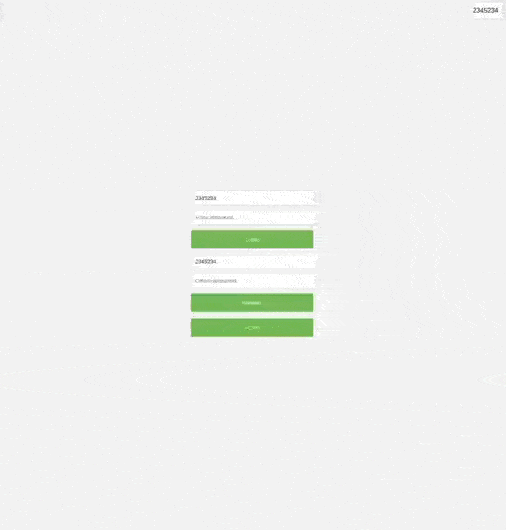

# DINOZAVRIKI
meet the best turn-based strategy about Dinosaurs battle! In this game, you face a difficult task: defeat the enemy using bombs, guns, whiskers, paws and tail.
## how to play?
click on the link and go to the game page. enter your username and password in the registration field. After the message about the successful registration, click **play**! you will end up in the waiting queue of the opponent.
## gameplay 
On the battlefield, you can use different things that will help you win. select the action on the button at the bottom. 
You will see blue cells that you can use an action on. for example, you can only walk up, down, left and right, and put a bomb anywhere around you. You can't walk on the stones, you can't put bombs on them either((.

Walk across the field and look around by selecting the walk button and clicking on the blue cell next to it!
> if there is no blue cells near you, wait for opponent's move!

 


You can place huge blue gun on the battlefield, which shoots with some circle things!


Now, when you get close to the enemy, drop a bomb on his head!


and that is how to win on the battlefield! good luck! 
# application
## Clone
First things first we need to clone our repo with the frontend submodule. to clone it properly, use:
```bash
git clone --recurse-submodules https://github.com/LeeDoor/game_webserver
```
> more about git submodules [here](https://git-scm.com/book/en/v2/Git-Tools-Submodules).

as mentioned in docs, if you forgot to place `--recurse-submodules` in `git clone` command, use:
```bash
git submodule update --init
```
## Docker
if you want to launch the webserver on your machine using docker, follow [docker](docs/docker.md) guide. 

## Required libraries
Don't forget to install all of the dependencies listed and guided [here](docs/install_deps.md). 

## Required applications
Webserver connects to databases such as [Redis](https://redis.io) and [PostgreSQL](https://postgresql.org/). If you would like to run them using docker, read docker's [database guide](docs/docker.md#databases).

## Build & Run application
You can run it without docker simply building it using CMake with bash scripts:
```bash
cd scripts
./build_no_tests.sh
./run_app.sh
```
> Here are [`build_no_tests.sh`](docs/bash_scripts.md#build_no_tests.sh) and [`run_app.sh`](docs/bash_scripts.md#run_app.sh) scripts used. 
> 
## Build & Run Tests
If you want to test the webserver, as previous, prepare all of the dependencies as [before](docs/install_deps.md) and build run these scripts:
```bash
cd scripts
./build_with_tests.sh
./run_tests.sh
```
> Here are [`build_with_tests.sh`](docs/bash_scripts.md#build_with_tests.sh) and [`run_tests.sh`](docs/bash_scripts.md#run_tests.sh) scripts used. 

## To see more about my bash scripts read [here](docs/bash_scripts.md)
# Code documentation
Src repo is separated on *modules*. All of the modules and their dependencies of each other shown in [dependency scheme](obsidian://open?vault=game_webserver&file=Obsidian%20Vault%2Fdependencies.canvas) and [code scheme](obsidian://open?vault=game_webserver&file=Obsidian%20Vault%2Fmain.canvas). To open it you need to use [obsidian](https://obsidian.md/) app.

# Working with the webserver
Webserver provides API for the users. [Full API documentation](docs/http_api.md) provided.