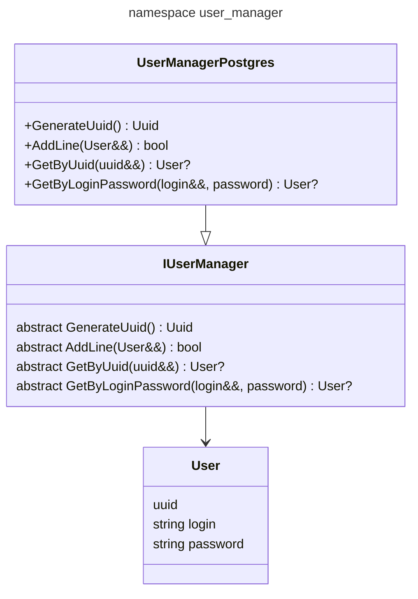

# [user_manager](https://github.com/LeeDoor/hex_chess_backend/tree/main/src/user_manager)
## what is it for?
this module gives api for communicating with database. it contains multithread-safe connection pool and high-level classes for http_hanlder  

## Classes
* **IUserManager** - interface for http_handler to contain database manager as pointer. it is required to have interface for easier moving between databases if i would want to.
* **UserManagerPostgres** - class inherits from **IUserManager**, contains realization of all interface classes for PostgreSQL.
* **User** - struct of user's data. there is a difference *user's* data and *player's* data. user's one contains only information about account, not related to current game. 
* *coming soon* **PlayerData** - struct of player's data. contains game-oriented game like elo, matches, history etc.
* **RegistrationData** - contains login and password for reading user's request. this struct is in *http_handler* namespace, but it is in this directory for easier access.

## graph
