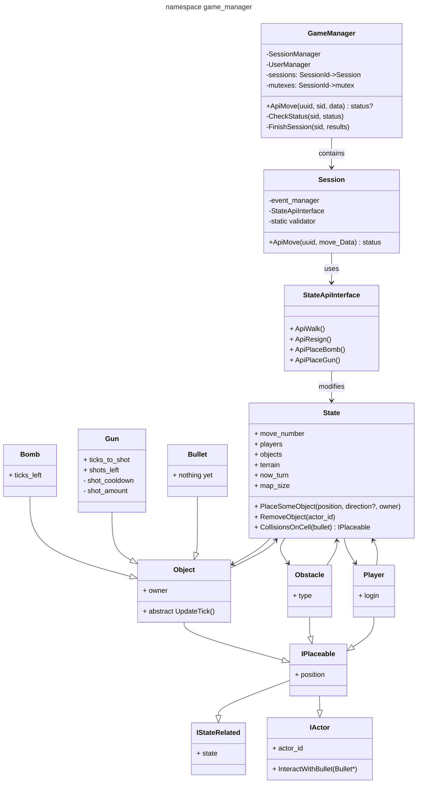

# [game_manager](https://github.com/LeeDoor/hex_chess_backend/tree/main/src/game_manager)
## What is it for
This module contains list of all sessions, creates, deletes them and provides api for [handler](http_handler) to control players in sessions.
##  classes
* **GameManager** - this class provides API to control all sessions together. To get access to session, you need to provide sessionId and player's Uuid, if required. Controls user's access to sessions.
* **Session** - provides possibility to GameManager to Interact with game state by special moves. Сhecks the possibility of a move in terms of game mechanics and rules. Validation happens with SessionValidators. 
* **State** - class which contains all data about game state. This structure is hidden by default, but may be modified by session and state actors. Session and in-game actors have unique API to the state. State contains **Objects**, **Obstacles**(terrain) and **Players**
* **SessionApiValidator** - class which should be built with **SessionApiBuilder**. On its creation it defines move mechanics and rules. Using brackets operator, you can validate your current move. As return value you get status of validation. 
* **Object** and **Obstacle** are some items on the map which can act on the field. The difference is that object needs to be updated after each move, while obstacle keeps static. State updates objects itself.
* **IStateRelated** - every object related to the state is state related. It means, this object can interact with state.
*  **IActor** - interface for every object that can interact with state and other objects.
* **IPlaceable** - placeable objects can have their position on state. Automatically inherits from IActor and IStateRelated. Objects, Obstacles, Players - all of them are placeables.

User should get all notifications about events happening in the game. All actions are listed and saved in special EventManager. It is required for reproducing the game state from it source state to actual state and for easier understanding about changed state.

Let's mention some class fields whose meaning may remain unclear.
* **Object::owner** - string with login of the player, who created given object.
* **actor_id** - id of the item, which can be interacted with or can interact with other objects.
* **Obstacle::Type** - type of the obstacle. Now it can be only Wall.

## Graph
