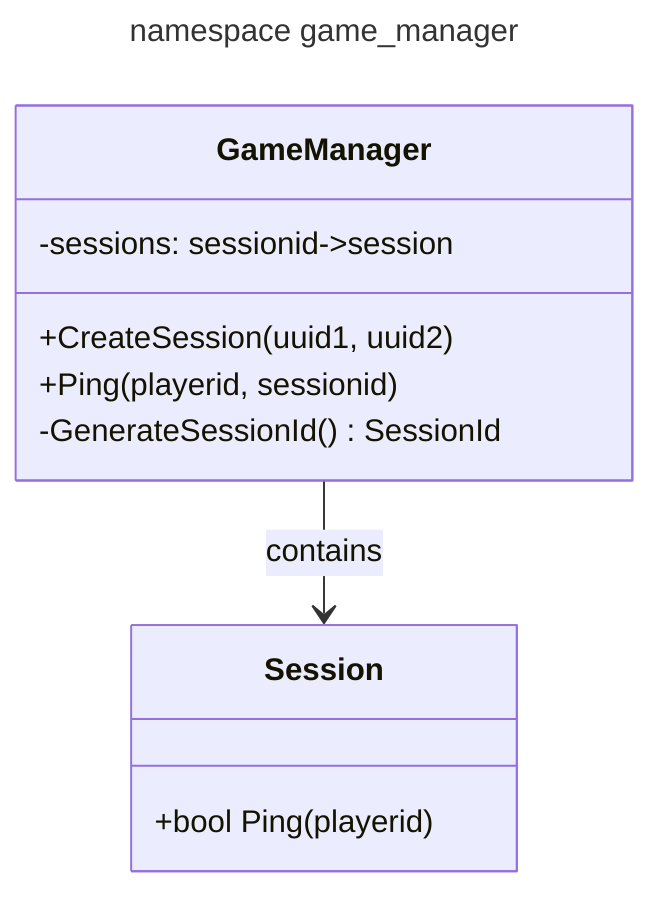

# [game_manager](https://github.com/LeeDoor/hex_chess_backend/tree/main/src/game_manager)
## what is it for
this module contains list of all sessions, creates, deletes them and provides api for [handler](http_handler) to control players in sessions.
##  classes
* **GameSession** - this class has map sessionId => session. this is required for faster and easier search by sessionid. class contains in-game api for sessions and api for creating sessions for given players.
## actions
#TODO
## graph
