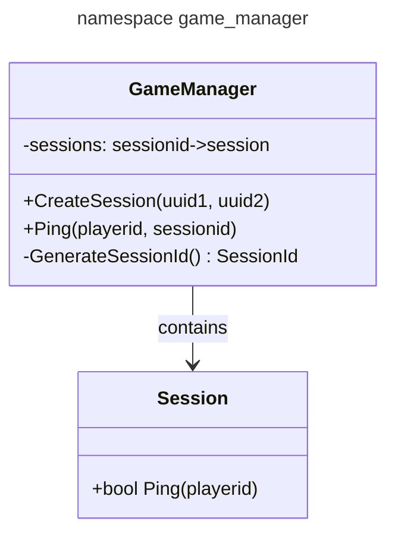

# [game_manager](https://github.com/LeeDoor/hex_chess_backend/tree/main/src/game_manager)
## What is it for
This module contains list of all sessions, creates, deletes them and provides api for [handler](http_handler) to control players in sessions.
##  classes
* **gamesession** - this class has map sessionid => session. This is required for faster and easier search by sessionid. Class contains in-game api for sessions and api for creating sessions for given players.
## Graph
