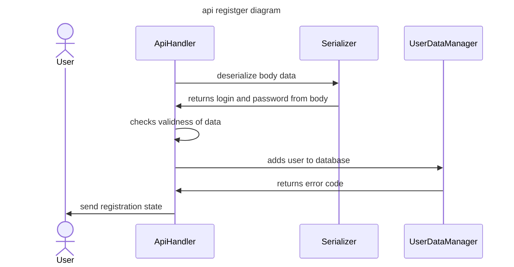
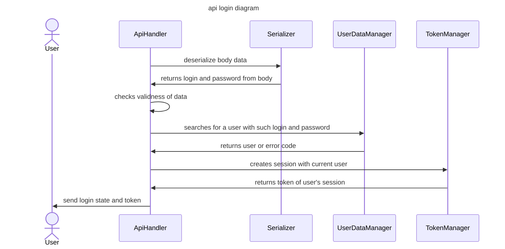
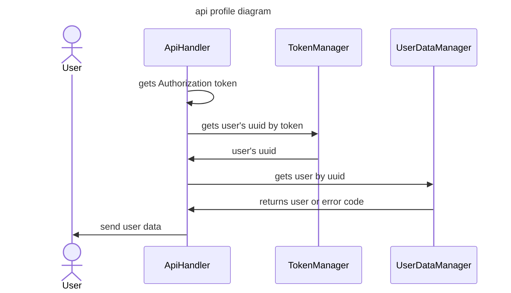
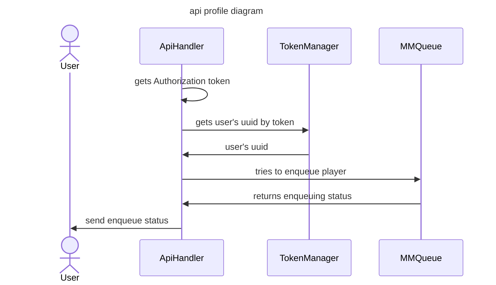
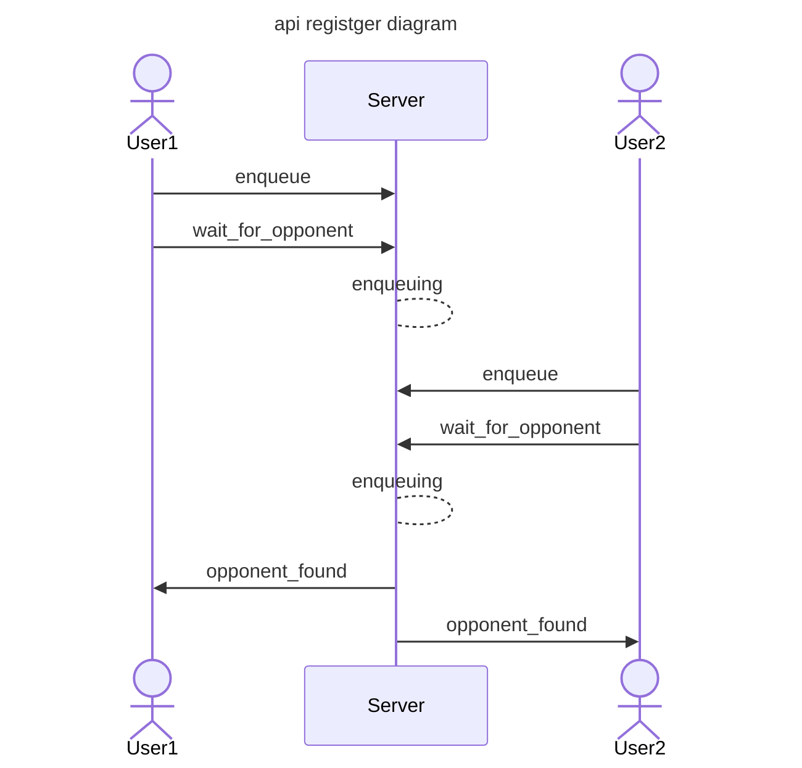

# http request API
## static files
to request static file from server, set relative path to root folder in request target like this: 
```
127.0.0.1/folder1/index.html
```
this url will return index.html file in folder1.
to get main index.html file it is not required to write file name. these two lines of request will get same response:
```
127.0.0.1/index.html
127.0.0.1/
``` 

# API

all non-ok responses have same body type. for example:
 
```js
{
    "error_name": "object_is_not_found",
    "description": "object that you are trying to access is not found"
}
```
## Debug API

debug api is required to get data from app structures. to execute them you need to send admin login and password.

example:
```js
{ 
	"login": "very_login", 
	"password": "abcde12345" 
}
```

### API player_tokens
#### **description**
debug function for getting users' authentication tokens and uuids.
#### **request target**
*/api/debug/player_tokens*

#### **request body example**
```js
    {
        "login": "admin2009",
        "password": "nadejni_parol2"
    }
```

#### **responses**
* `200 OK`\
    tokens sent successfully

    *response body example:*
    ```js
    {
        "token1AV24":   "UUID173578",
        "token22724":   "UUID116478",
        "token3AVA324": "UUID1735788",
    }
    ```
    
* `401 unauthorized`\
    admin login or password are invalid.

---
### API user_data
#### **description**
debug function for getting users' profile info like login and password.
#### **request target**
*/api/debug/user_data*

#### **request body example**
```js
    {
        "login": "admin2009",
        "password": "nadejni_parol2"
    }
```

#### **responses**
* `200 OK`\
    user_data sent successfully

    *response body example:*
    ```js
    {
        {"player_serega", "2012_serega@enjoyer"},
        {"player_vasyan", "2009_vasili@pupkin"},
        {"na@ibat0R", "Ilinskaya12"}
    }
    ```
    
* `401 unauthorized`\
    admin login or password are invalid.

---
### API matchmaking_queue
#### **description**
debug function for getting queue of users' uuids
#### **request target**
*/api/debug/matchmaking_queue*

#### **request body example**
```js
    {
        "login": "admin2009",
        "password": "nadejni_parol2"
    }
```

#### **responses**
* `200 OK`\
    matchmaking queue sent successfully

    *response body example:*
    ```js
    {
        "UUID123",
        "UUID124",
        "UUID125"
    }
    ```
    
* `401 unauthorized`\
    admin login or password are invalid.


---
### API sessions_list
#### **description**
debug function for getting list of sessions with playing users.
#### **request target**
*/api/debug/sessions_list*

#### **request body example**
```js
    {
        "login": "admin2009",
        "password": "nadejni_parol2"
    }
```

#### **responses**
* `200 OK`\
    sessions list sent successfully

    *response body example:*
    ```js
    {
        "sessionId1":{
            "player1":"UUID123",
            "player2":"UUID228",
        }
    }
    ```
    
* `401 unauthorized`\
    admin login or password are invalid.

## User API
### API register
#### **action diagram**

#### **request target**
*/api/register*

#### **function description**
by given login and password in body, creates account. data stored in db, you cant register with same login more than once. after registration you need to login to play the game and use other features. 

#### **request body example**
```js
    {
        "login": "very_login",
        "password": "abcde12345"
    }
```
#### **login and password criteria**
- login size more or equal to **3**
- password size more or equal to **6**. must contain at least 1 digit

#### **responses**
* `200 OK`\
    registration is ok, user added

    *response body:*
    ```js
    {}
    ```
    
* `400 bad_request`\
    body data is wrong or login and password are invalid

    **error_name meanings**
    - **wrong_login_or_password**: login or password are invalid (watch description with criteria)
    - **body_data_error**: body data is incorrect (watch example above)

* `409 conflict`\
    there is already a user with given login

    **error_name meanings**
    - **login_taken**: login already taken

---
### API login
#### **action diagram**


#### **request target**
*/api/login*

#### **function description**
by given login and password in body, logins to get authorization token, which is required to play. only registered user can login.

#### **body example**
```js
    {
        "login": "very_login",
        "password": "abcde12345"
    }
```

#### **responses**
* `200 OK`\
    login is successful, token returned
    
    *response body"*
    ```js
    {
        "token": "aabbbccc123"
    }
    ```
    **login and password criteria**
    - login size more or equal to **3**
    - password size more or equal to **6**. must contain at least 1 digit

* `400 bad_request`\
    body data is wrong or login and password doesnt match to any registered user

    **error_name meanings**
    - **body_data_error**: body data is incorrect (watch example above)
    - **wrong_login_or_password**: login or password are invalid (watch description with criteria)
    - **no_such_user**: no user found with given login and password
---
### API profile
#### <span style="color:#87ff8b"><b>requires authorization</b></span>

#### **action diagram**



#### **request target**
*/api/profile*

#### **function description**
requires authorization token. by this token gets profile information from db.

#### **responses**
* `200 OK`\
    authorization is correct, send profile data in response
    
    *response body"*
    ```js
    {
        "login": "loginlogin",
        "password": "pass123123"
    }
    ```

* `401 unauthorized`\
    no authorization header, invalid token or person with this token is removed

    **error_name meanings**
    - **unathorized**: request must be authorized with Authorization header
    - **invalid_token**: request authorization is invalid (token in Authorization header has wrong format)
    - **person_removed**: person with this token is unavailable (probably removed)

---
## Game API
### API enqueue
#### <span style="color:#87ff8b"><b>requires authorization</b></span>

#### **action diagram**

#### **request target**  
_/api/game/enqueue_

#### **function description**
to start a game, you need to add yourself to the queue. you will be added to queue to search for an opponent by this api function execution. call wait_for_opponent immediately after that.

#### **request body example**
body must be empty

#### **responses**
* `200 OK`  
*response body:*
    ```js
    {}
    ```
    
* `200 OK`  
**error_name meanings**
    - **enqueue_error**: error happened while enqueuing player (already in queue or wrong token)

---
### API wait_for_opponent
#### <span style="color:#87ff8b"><b>requires authorization</b></span> 
#### <span style="color:#f58a42"><b>Long-Poll</b></span> 

#### **action diagram**


#### **request target**  
_api/game/wait_for_opponent_

#### **function description**
long-poll function to read data about future session. use it after enqueuing to the game and wait for response until enemy is found. when found, returns session ID to join the game.

#### **request body example**

```js

```

#### **responses**

* `200 success`
opponent found if body contains SessionId.
*response body:*
```js
{
	"sessionid": "ADD124558846"
}
```
* `200 waiting`
if body is empty it means that no opponent found yet.
*response body:*
```js
{}
```
* `409 poll_closed`
means that for your account there is another opened poll waiting. this poll closes and data will be sent to a new poll.
