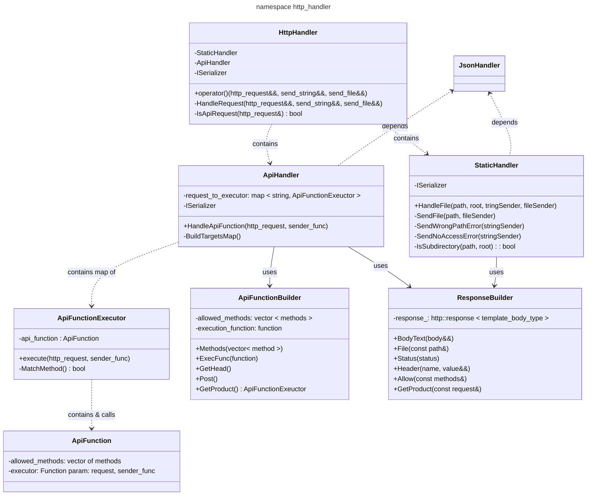

# [http_handler](https://github.com/LeeDoor/hex_chess_backend/tree/main/src/http_handler)
## what is it for
this module contains a bunch of files to handle each http request. this module is used by [server](https://github.com/LeeDoor/hex_chess_backend/blob/main/docs/server.md) module via **HttpHandler** class.
## classes
* **HttpHandler** - connecting point with this module. its *operator()* handles passed HTTP reuqest and responses it, sending data to **one** of passed send functions (one for string response, other for file response). inside contains two separated handlers for API requests and static file requests
* **Static Handler** - handles requests for static files, like html pages and javascript scripts. it also requires sender for string because if request is wrong, it will send string error text in JSON format.
* **Api Handler** - handles api requests. in project there will be a bunch of api entry points, so i created a class system to handle them more comfortable. each API entry point is presented with map, where key is HTTP target, like */api/send/privet/* and value is **ApiFunctionExecutor** object. each **ApiFunctionExecutor** object is created with special builder **ApiFunctionBuilder**.
* **ApiFunctionBuilder** - creates **ApiFunctionExecutor** objects with required:
    1. allowed methods
    2. LIST WILL BE FINISHED AS PROJECT PROGRESS MOVE ON
* **ApiFunctionExecutor** - launches execution of **ApiFunction**. in fact, this class is a wrapper over the **ApiFunction**, since first it runs all the verification functions to correlate the request data and the allowed data (for example, so that the request method is correct) and only then **ApiFunction** is executed.
* **ApiFunction** - contains data built by **ApiFunctionBuilder**. it is just a function of api method.
* **ResponseMaker** - bunch of functions for preparing http responses. moved this to separate cpp because it takes a lot of lines to form it up each time i need it

all handlers have [ISerializer](https://github.com/LeeDoor/hex_chess_backend/blob/main/docs/serializer.md) object. this object can serialize/deserialize data to string and vice versa. made it with interface because i may want to change format from JSON to XML or smth in future.
## graph
whole class system looks like this: 

