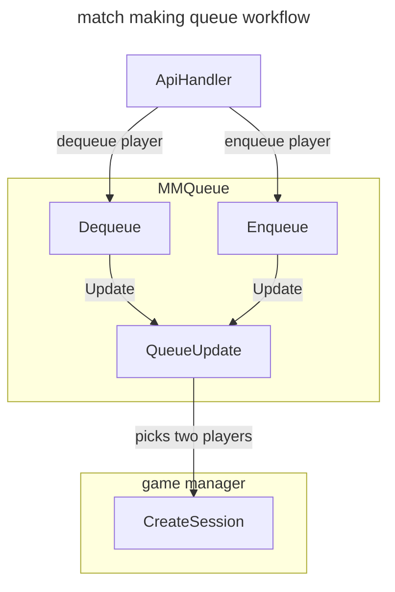
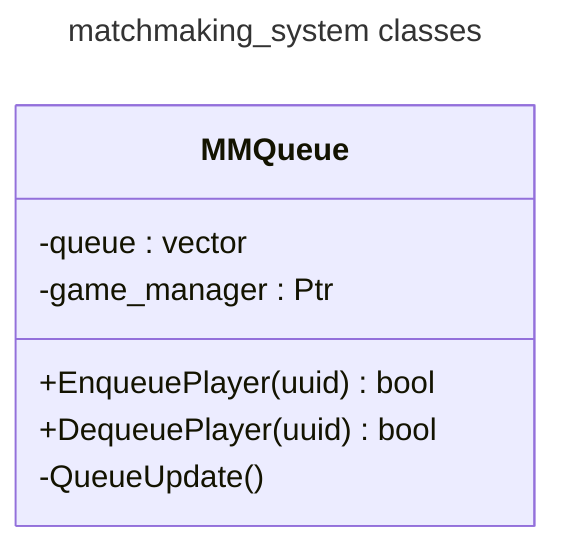

# [matchmaking_system](https://github.com/LeeDoor/hex_chess_backend/tree/main/src/matchmaking_system)
## what is it for
this module contains queue of players to join match, determines the pairs of players to play together and passes players to the next module [[game_manager]] to create game.
##  classes
* **MMQueue** - contains a queue of players. using this class, [[http_handler|api handler]] interacts with the queue.
## actions

## graph
