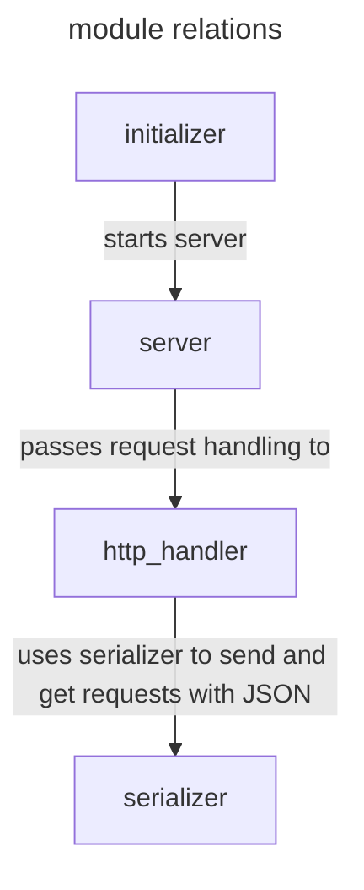

# what is module
project consists of several modules which a tied up with each other. whole bunch of modules presented here:



each node is clickable to read more info about module.

# how to create module
root contains bash script called [*add_dependency.sh*](https://github.com/LeeDoor/hex_chess_backend/blob/main/add_dependency.sh). launch it with name of new module like:
```
./add_dependency.sh initializer
```
it will create new directory with default cmake file. also you **need** to enter the name of module in main cmake:
```
#list with all libraries
set (DEPENDENCIES serializer initializer server http_handler !!!ENTER MODULE NAME HERE!!!)
```
and in newly created one:
```
#initializer's dependencies
set(DEPENDENCIES  !!!PLACE FOR DEPENDENCIES!!!)
set(LIBRARY_NAME !!!ENTER MODULE NAME HERE!!!)
#creating library
add_library(${LIBRARY_NAME}
    !!!ENTER SOURCE FILES HERE!!!
)

#including and linking dependencies
target_link_libraries(${LIBRARY_NAME} PUBLIC ${DEPENDENCIES})
foreach (dir IN ITEMS ${DEPENDENCIES})
    target_include_directories(${LIBRARY_NAME} PUBLIC "../${dir}")
endforeach ()
```

# created CMake file
newly created cmake file contains two variables.
* **DEPENDENCIES** - list of modules that are required for this module. should be entered space-separated like [here](https://github.com/LeeDoor/hex_chess_backend/blob/main/src/server/CMakeLists.txt)
* **LIBRARY_NAME** - name of library. the variable is needed so that other modules can refer to it by name (to pass it in DEPENDENCIES list for example).

variables are followed by add_libary command. it creates dynamic library (change [build.sh](https://github.com/LeeDoor/hex_chess_backend/blob/main/build.sh) script if you want to create shared library) with given source files.

after that cmakelists links dependencies to our project and targetly includes headers from other folders in cycle. thats why all modules must be in one directory: [hex_chess_backend/src](https://github.com/LeeDoor/hex_chess_backend/tree/main/src)