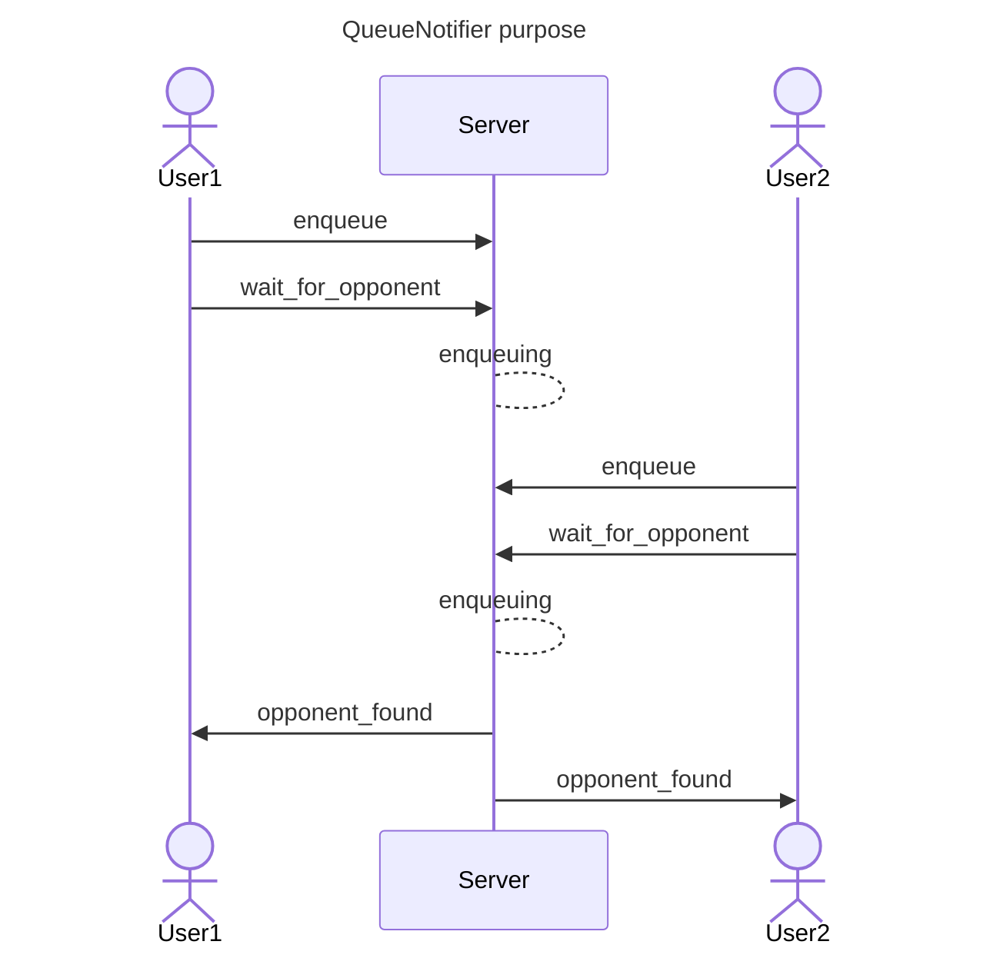
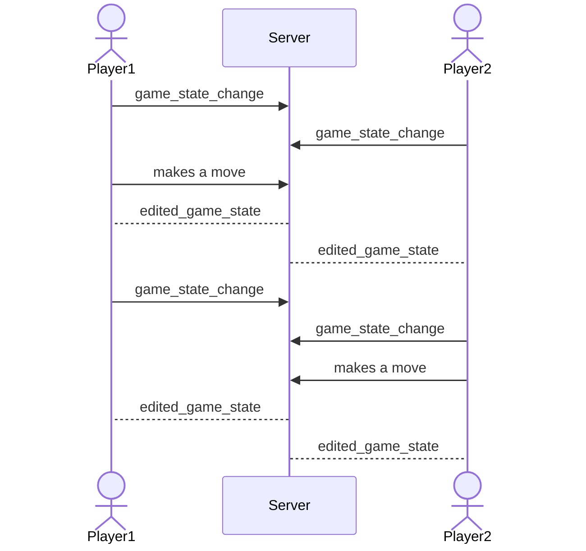
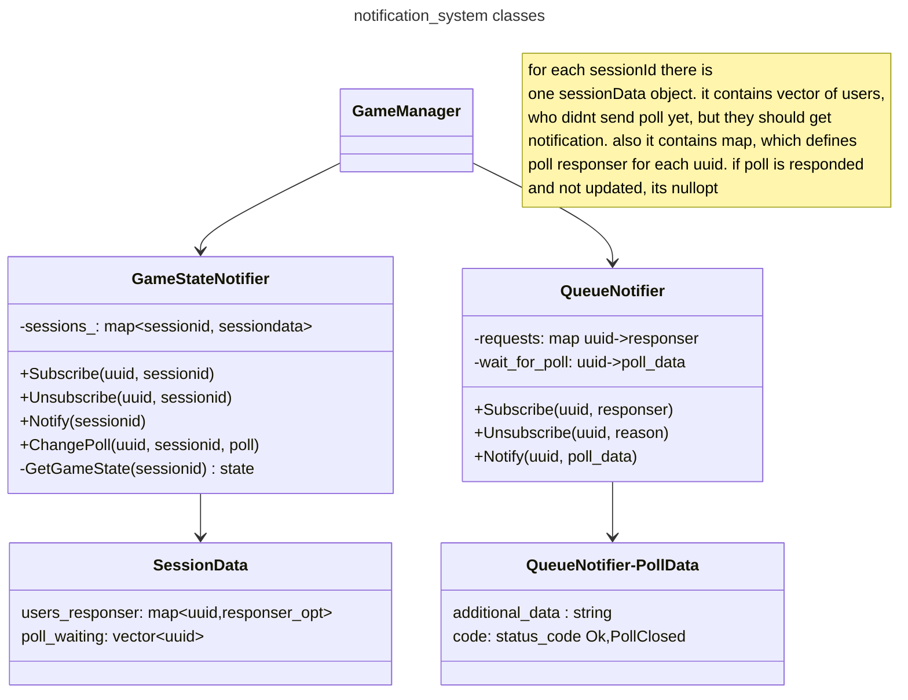

# what is it for
notification system notifies users about in-game actions e.g. player found, enemy made a move etc.
it is achieved by using long-poll requests. user sends request to server and waits for response. once server is ready to respond, it sends response to active poll.
all notifiers are Singleton objects for easier access.
## why singletons?
other managers which handlers and other dudes use are just shared_pointers to one object. but notifiers cant be like that, because they store data about sockets, where we should call long-poll response. it cant be stored in third-party db, so singleton/global variable required.
# classes
* **QueueNotifier** - class, which takes care about notifying in-queue players about found enemies. when opponent is found, player's hanging poll returns sessionId. if opponent found before poll request sent, you still able to get response by waiting system. once notifier calls, all pollers are being unsubscribed. 

* **SessionStateNotifier** - class, which takes care about notifying players in the game and game spectators about happening actions in the game. once notified, notifier waits for a new poll and resubs user untill it unsubscribes. it means if session state updated since last poll and new poll was not sent yet, a new poll will get response immediately. if a game state updated twice or more, poll will get last game state.

## graph
