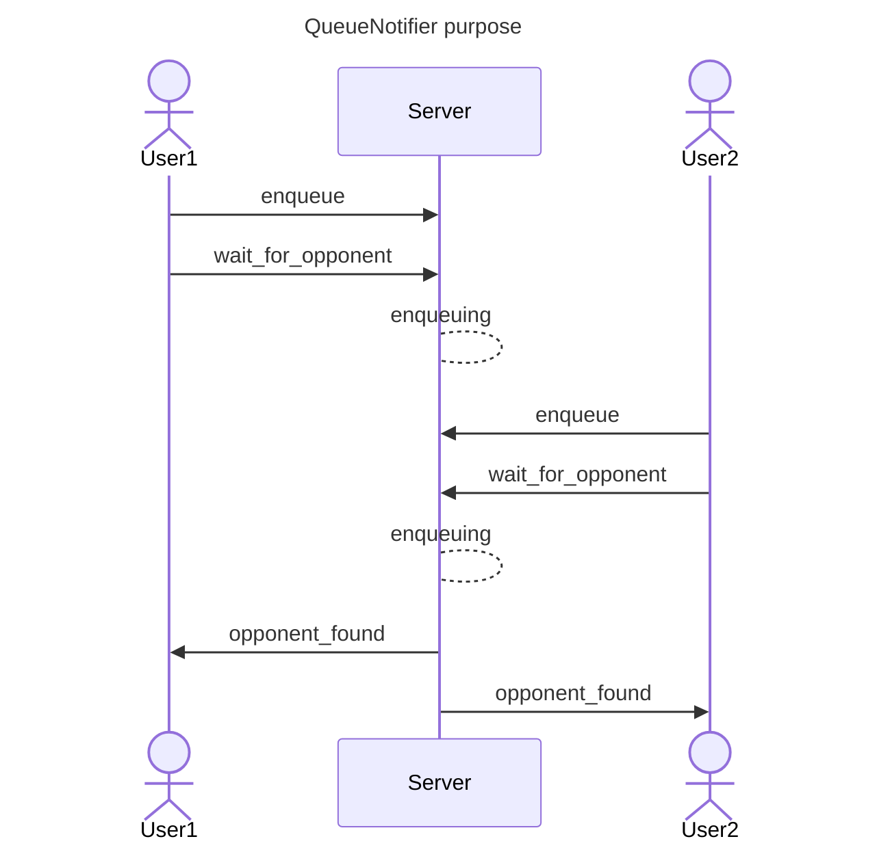
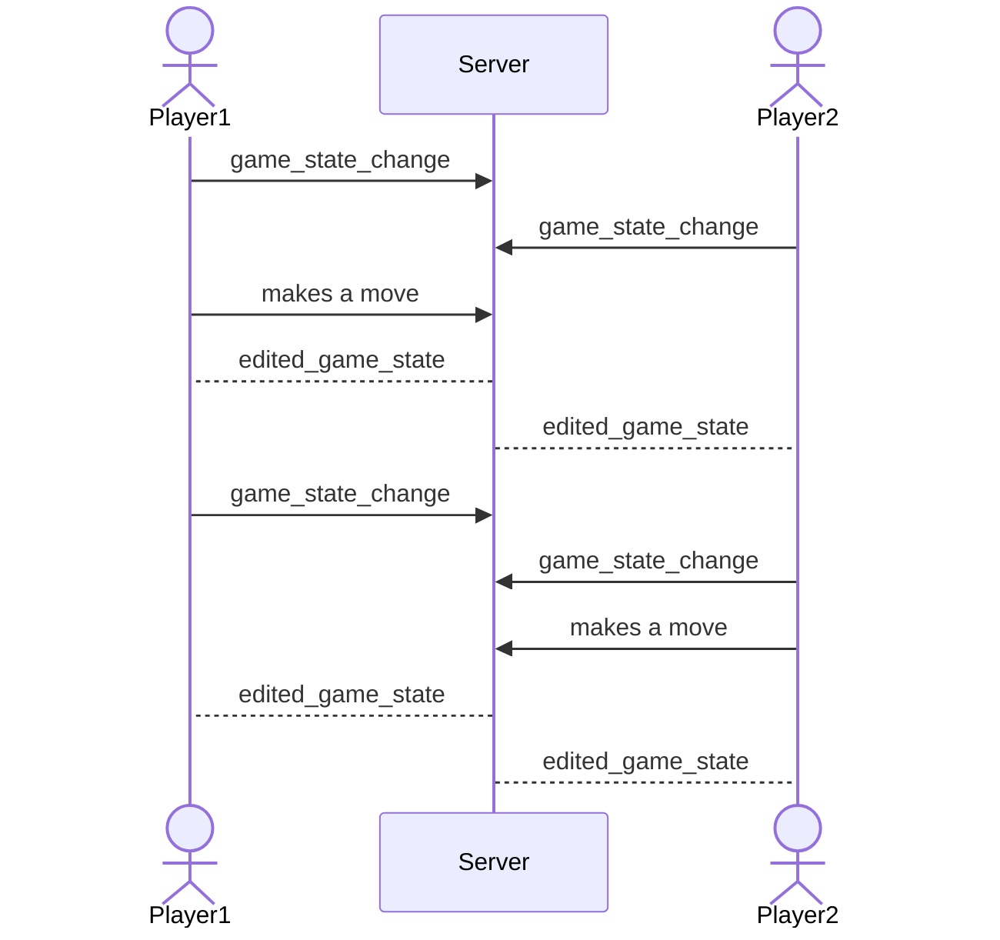
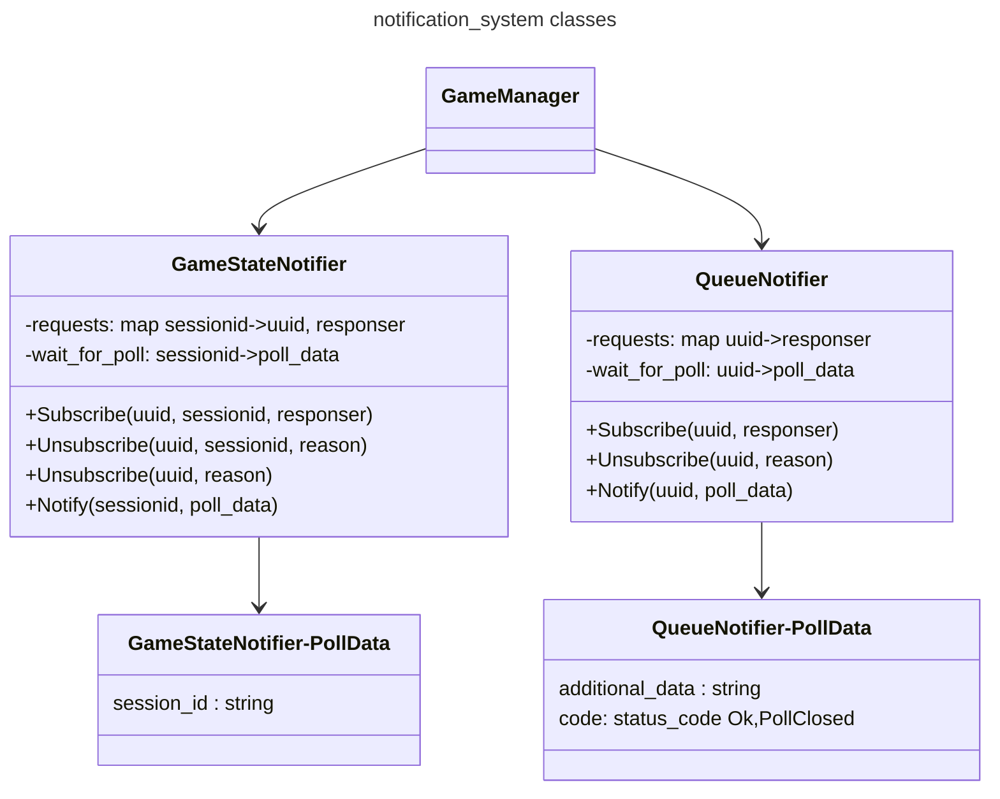

# what is it for
notification system notifies users about in-game actions e.g. player found, enemy made a move etc.
it is achieved by using long-poll requests. user sends request to server and waits for response. once server is ready to respond, it sends response to active poll.
all notifiers are Singleton objects for easier access.
# classes
* **QueueNotifier** - class, which takes care about notifying in-queue players about found enemies. once notifier calls, all pollers are being unsubscribed.

* **GameStateNotifier** - class, which takes care about notifying players in the game and game spectators about happening actions in the game. once notified, notifier waits for a new poll and resubs user untill it unsubscribes.

## graph
