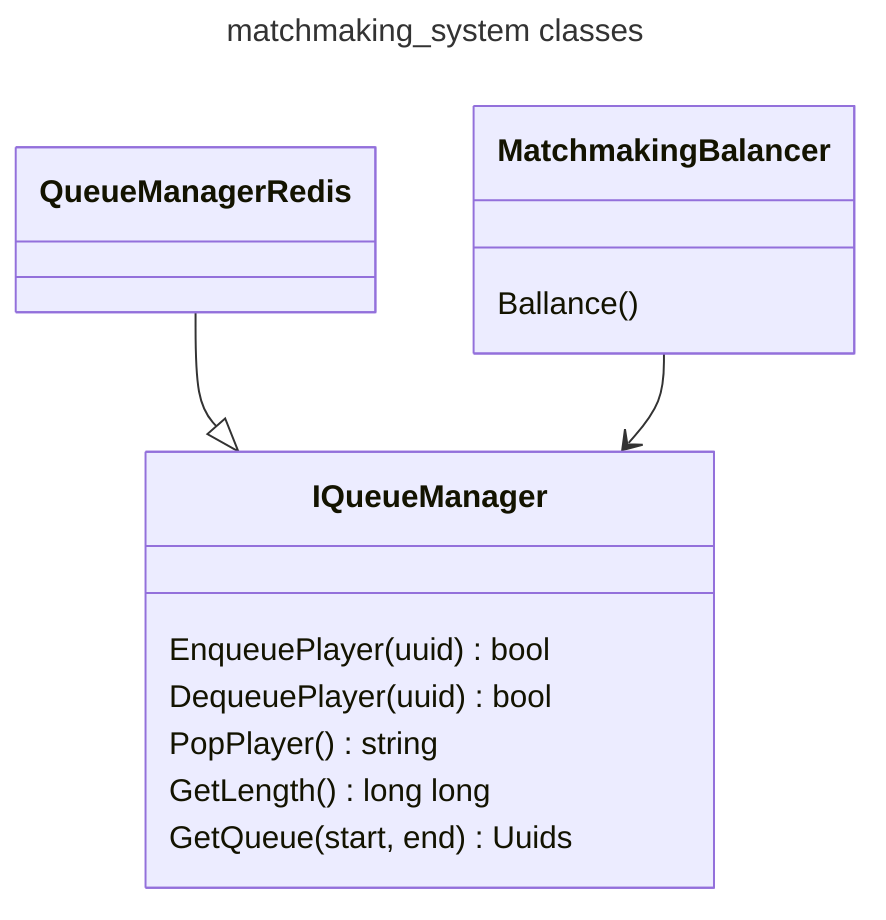

# [queue_manager](https://github.com/LeeDoor/game_webserver/tree/main/src/queue_manager)
## What is it for
this module communicates with redis to contain queue of players to join match, determines the pairs of players to play together and passes players to the next module [[game_manager]] to create game.
##  classes
* **IQueueManager** - interface provides all options that database communicator should have. Using this class, [api handler](http_handler.md) and matchmaking_balancer interacts with the queue.
* **QueueManagerRedis** - child of **IQueueManager**. Provides realization for that interface for redis database.
* **MatchmakingBalancer** - class for balancing players in queue and creating matches for them.
## Graph
