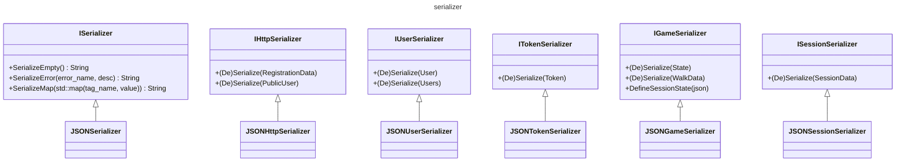

# [serializer](https://github.com/LeeDoor/hex_chess_backend/tree/main/src/serializer)
## what is it for
to communicate with http requests it is necessary to serialize and deserialize data from text according to one single format. i am using JSON. to separate logic of serialization with user-class, i use interface for each module in the project. i separated serializers for faster building and linking.
## graph
graph firstly might look overwhelmly
