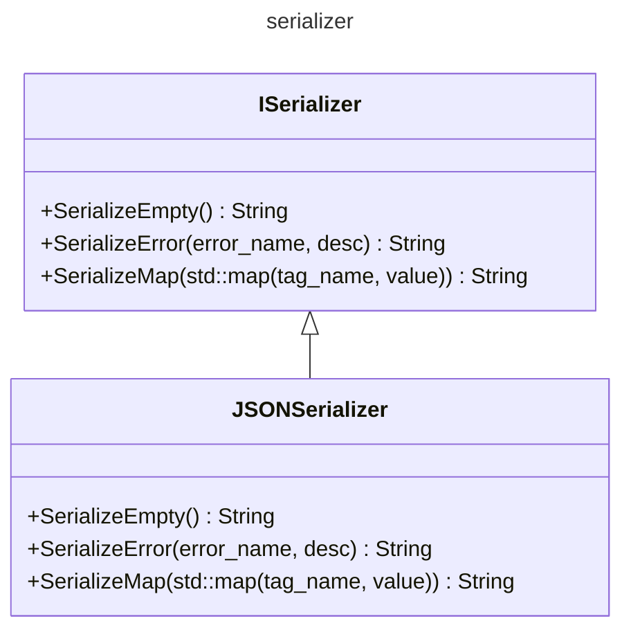

# [serializer]("https://github.com/LeeDoor/hex_chess_backend/tree/main/src/serializer")
## what is it for
to communicate with http requests it is necessary to serialize and deserialize data from text according to one single format. it may change one day, but now i am using JSON. to separate logic of serialization with user-class, i used interface *ISerializer*.
## classes
* **ISerializer** - base interface class for each serializer class. contains basic functions which are required to be in each child class (abstract class).
* **JSONSerializer** - child of **ISerializer** class. overrides all functions from it serializing and deserializing json text. 
## graph
graph firstly might look overwhelmly
