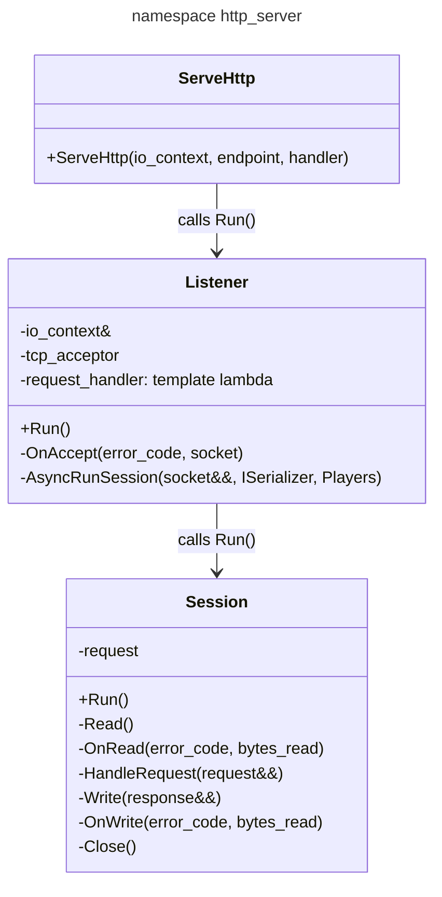
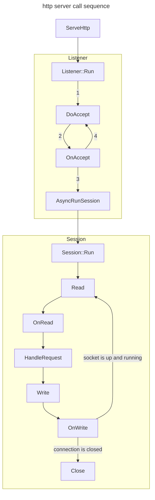

# [server](https://github.com/LeeDoor/hex_chess_backend/tree/main/src/server)
## what is it for
server module launches server and starts handling incoming HTTP requests.
## classes
here you can see graph of classes in server module:

## actions
here is the sequence of operations which each class preparing:
* **listener** class waits for request and passses handling to **session** class
* **session** reads data from user, handles it with [http_handler](http_handler.md) and sends back response from server

