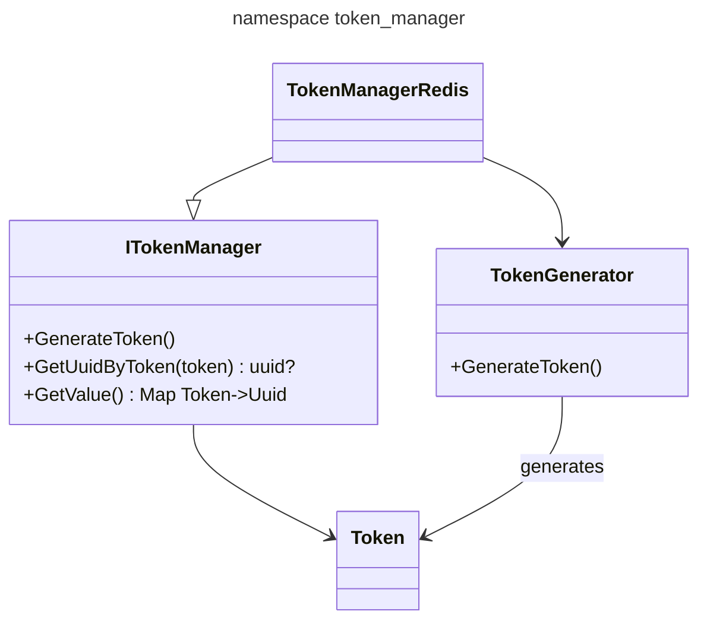

# [token_manager](https://github.com/LeeDoor/hex_chess_backend/tree/main/src/token_manager)
Application uses authorization system. When player logins by passing login and password to */api/login* (must be registered before) server responses with token value. To have access to forbidden data as concrete user, request must contain **Authorization** header. Example:
```
Authorization: Bearer {token}
```
Token_manager module communicates with redis database to keep link between token and user's login.

## Classes
* **token** - not a class or struct, just string called *Token*
* **TokenGenerator** - class generates token with 32 hexadecimal numbers
* **ITokenManager** - interface for token manager. Interface used for more easy and smooth migration between db if needed.
*  **TokenManagerRedis** - child of *i_token_manager*. Implements all features for *redis* bd.

## Graph

