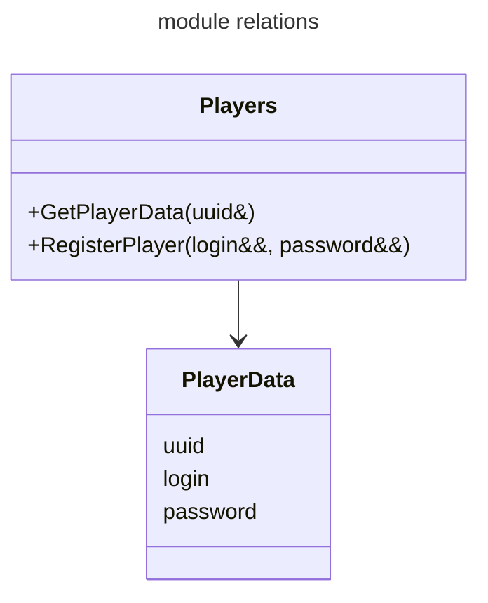

# [user_data](https://github.com/LeeDoor/hex_chess_backend/tree/main/src/user_data)
## what is it for
to communicate with database like registrating and logining players and getting player information
as id for players i am using [uuid](https://en.wikipedia.org/wiki/Universally_unique_identifier)
## classes
* **PlayerData** - structure to contain player's login, password and id in database.
* **Players** - class which communicates with database.
## graph

