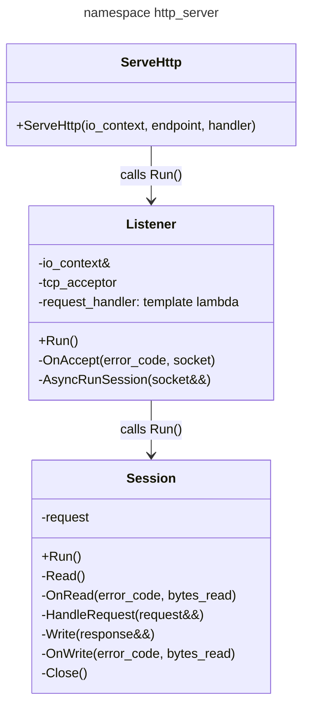
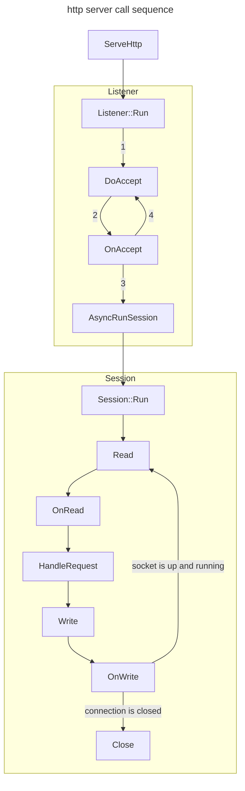
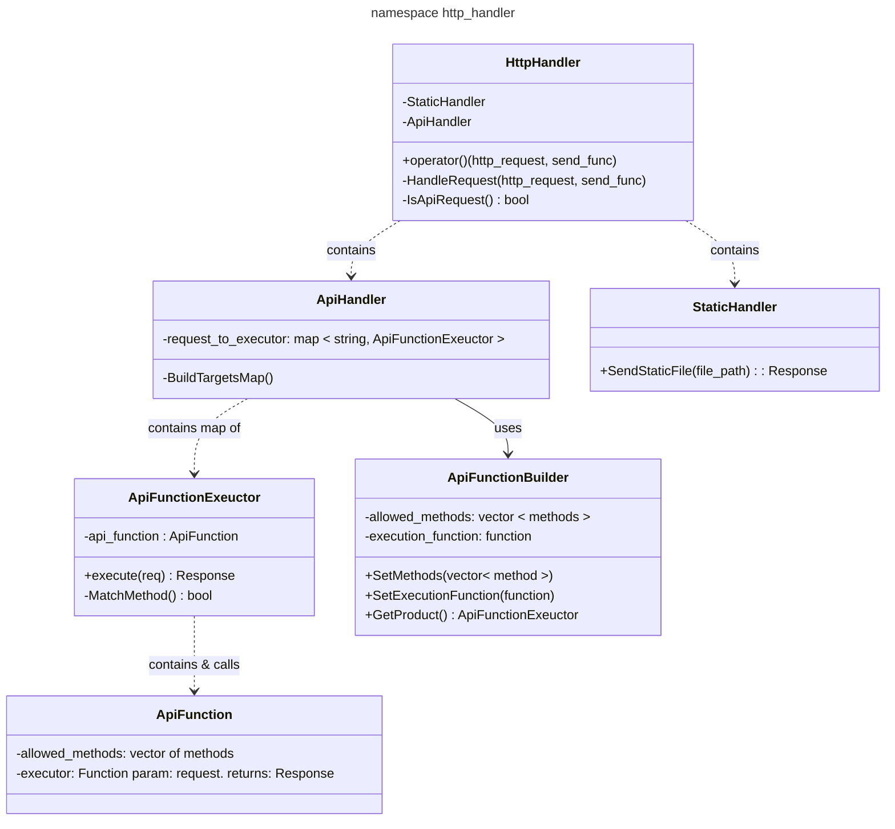

# UML diagrams online
i use [this](https://www.mermaidchart.com) website to visualize UML diagrams 

### http server class diagram

```mermaid
---
title: namespace http_server
---
classDiagram
    class ServeHttp{
        +ServeHttp(io_context, endpoint, handler)
    }
    class Listener{
        +Run()
        -OnAccept(error_code, socket)
        -AsyncRunSession(socket&&)
        -io_context&
        -tcp_acceptor
        -request_handler: template lambda
    }
    class Session{
        +Run()
        -Read()
        -OnRead(error_code, bytes_read)
        -HandleRequest(request&&)
        -Write(response&&)
        -OnWrite(error_code, bytes_read)
        -Close()
        -request
    }

    ServeHttp-->Listener : calls Run()
    Listener-->Session : calls Run()
```

### http server call sequence

```mermaid
---
title: http server call sequence
---
flowchart TB
    ServeHttp --> Listener::Run
    subgraph Listener
        Listener::Run --1--> DoAccept
        DoAccept --2--> OnAccept
        OnAccept --3--> AsyncRunSession
        OnAccept --4--> DoAccept
    end
    subgraph Session
        AsyncRunSession --> Session::Run
        Session::Run --> Read
        Read --> OnRead
        OnRead --> HandleRequest
        HandleRequest --> Write
        Write --> OnWrite
        OnWrite --connection is closed--> Close
        OnWrite --socket is up and running--> Read
    end
```

### http handler class diagram

```mermaid
---
title: namespace http_handler
---
classDiagram
    class HttpHandler {
        +operator() (http_request, send_func)
        -HandleRequest(http_request, send_func)
        -IsApiRequest() bool

        -StaticHandler
        -ApiHandler
    }

    class ApiHandler {
        -request_to_executor: map < string, ApiFunctionExeuctor >
        -BuildTargetsMap()
    }

    class StaticHandler {
        +SendStaticFile(file_path) : Response
    }

    class ApiFunction {
        -allowed_methods: vector of methods
        -executor: Function param: request. returns: Response
    }

    class ApiFunctionExeuctor {
        +execute(req) Response
        -MatchMethod() bool
        -api_function : ApiFunction
    }

    class ApiFunctionBuilder {
        +SetMethods(vector< method >)
        +SetExecutionFunction(function)
        +GetProduct() ApiFunctionExeuctor

        -allowed_methods: vector < methods >
        -execution_function: function
    }

    HttpHandler ..> ApiHandler : contains
    HttpHandler ..> StaticHandler : contains
    ApiHandler ..> ApiFunctionExeuctor : contains map of
    ApiHandler --> ApiFunctionBuilder : uses
    ApiFunctionExeuctor ..> ApiFunction : contains & calls
```